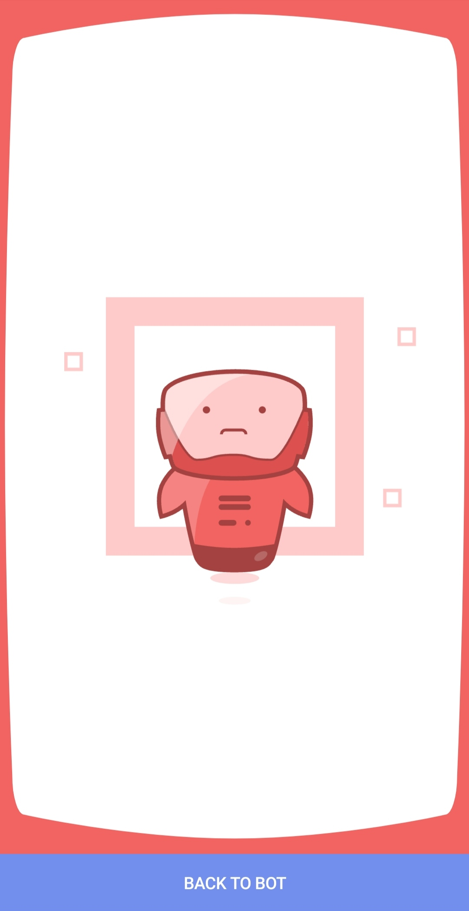

<div id="top"></div>

[![Contributors][contributors-shield]][contributors-url]
[![Forks][forks-shield]][forks-url]
[![Stargazers][stars-shield]][stars-url]
[![Issues][issues-shield]][issues-url]
[![MIT License][license-shield]][license-url]

<!-- PROJECT LOGO -->
<br />
<div align="center">
<h2 align="center">validating-data</h2>
  <p align="center">
    project to validate telegram web app data.
    <br />
    <br />
    <a href="https://github.com/OxMohsen/validating-data/blob/main/example">Example</a>
    ·
    <a href="https://github.com/OxMohsen/validating-data/issues">Report Bug</a>
    ·
    <a href="https://github.com/OxMohsen/validating-data/issues">Request Feature</a>
  </p>
</div>


<!-- TABLE OF CONTENTS -->
<details>
  <summary>Table of Contents</summary>
  <ol>
    <li>
      <a href="#about-the-project">About The Project</a>
      <ul>
        <li><a href="#built-with">Built With</a></li>
      </ul>
    </li>
    <li>
      <a href="#getting-started">Getting Started</a>
      <ul>
        <li><a href="#installation">Installation</a></li>
      </ul>
    </li>
    <li><a href="#usage">Usage</a></li>
    <li><a href="#contributing">Contributing</a></li>
    <li><a href="#license">License</a></li>
    <li><a href="#contact">Contact</a></li>
  </ol>
</details>


<!-- ABOUT THE PROJECT -->
## About The Project

valid data             |  invalid data
:-------------------------:|:-------------------------:
  |  


php code for validating incoming data from telegram web app bot to ensure that the data is valid and comes from the telegram. in example folder you can see how to use this code by using `ajax` and `php`.
<p align="right">(<a href="#top">back to top</a>)</p>


### Built With

* [PHP](https://www.php.net/)
* [JQuery](https://jquery.com)

<p align="right">(<a href="#top">back to top</a>)</p>


<!-- GETTING STARTED -->
## Getting Started

These instructions will get you a copy of the project and show you how to use it.
You'll need [Git](https://git-scm.com) and [composer](https://getcomposer.org/download/)

### Installation
1. using composer
   ```sh
   composer require oxmohsen/validating-data
   ```

2. install manually
    - Clone the repo
        ```sh
        git clone https://github.com/OxMohsen/validating-data.git
        ```
    - move to the directory
        ```sh
        cd validating-data
        ```
    - Install composer packages
        ```sh
        composer install
        ```

### Usage
1. load the project
    ```php
    require_once __DIR__ . '/vendor/autoload.php';

    use OxMohsen\TgBot\Validate;
    ```
2. use the Validate class to validate initData
   ```php
   if (Validate::isSafe($bot_token, $initData)) {
       echo 'valid data';
   } else {
       echo 'invalid data';
   }
   ```
you can also see a simple example in the [example folder](https://github.com/OxMohsen/validating-data/tree/main/example).

<p align="right">(<a href="#top">back to top</a>)</p>


<!-- CONTRIBUTING -->
## Contributing

Contributions are what make the open source community such an amazing place to learn, inspire, and create. Any contributions you make are **greatly appreciated**.

If you have a suggestion that would make this better, please fork the repo and create a pull request. You can also simply open an issue with the tag "enhancement".
Don't forget to give the project a star! Thanks again!

1. Fork the Project
2. Create your Feature Branch (`git checkout -b feature/AmazingFeature`)
3. Commit your Changes (`git commit -m 'Add some AmazingFeature'`)
4. Push to the Branch (`git push origin feature/AmazingFeature`)
5. Open a Pull Request

<p align="right">(<a href="#top">back to top</a>)</p>


<!-- LICENSE -->
## License

Distributed under the MIT License. See `LICENSE` for more information.

<p align="right">(<a href="#top">back to top</a>)</p>


<!-- CONTACT -->
## Contact

Mohsen Falakedin - [@oxmohsen](https://t.me/oxmohsen) - oxmohsen@oxmohsen.ir

Project Link: [https://github.com/OxMohsen/validating-data](https://github.com/OxMohsen/validating-data)

<p align="right">(<a href="#top">back to top</a>)</p>


<!-- MARKDOWN LINKS & IMAGES -->
[contributors-shield]: https://img.shields.io/github/contributors/OxMohsen/validating-data.svg?style=for-the-badge
[contributors-url]: https://github.com/OxMohsen/validating-data/graphs/contributors
[forks-shield]: https://img.shields.io/github/forks/OxMohsen/validating-data.svg?style=for-the-badge
[forks-url]: https://github.com/OxMohsen/validating-data/network/members
[stars-shield]: https://img.shields.io/github/stars/OxMohsen/validating-data.svg?style=for-the-badge
[stars-url]: https://github.com/OxMohsen/validating-data/stargazers
[issues-shield]: https://img.shields.io/github/issues/OxMohsen/validating-data.svg?style=for-the-badge
[issues-url]: https://github.com/OxMohsen/validating-data/issues
[license-shield]: https://img.shields.io/github/license/OxMohsen/validating-data.svg?style=for-the-badge
[license-url]: https://github.com/OxMohsen/validating-data/blob/master/LICENSE
